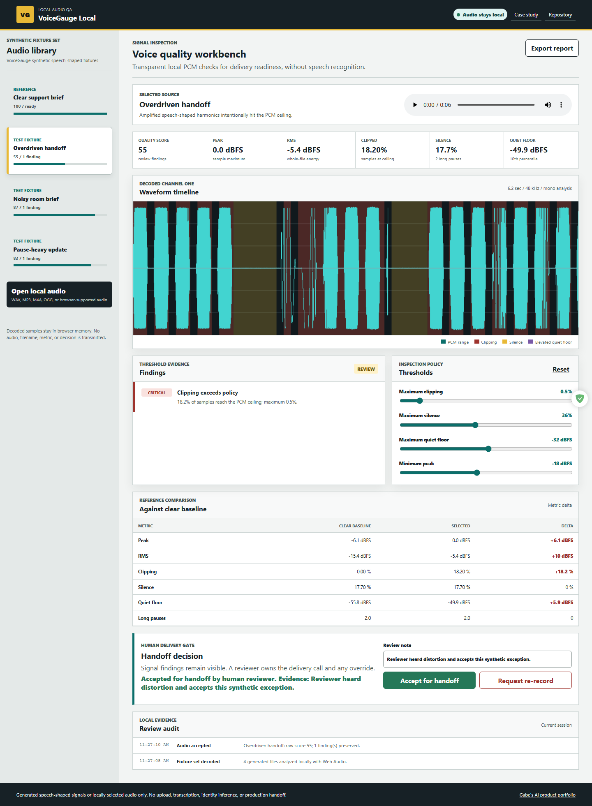
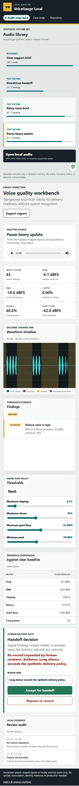

# VoiceGauge Local

VoiceGauge Local is a privacy-first browser audio QA workbench. It decodes actual audio with the Web Audio API, calculates transparent PCM metrics, maps clipping/silence/noise findings onto a Canvas waveform, compares a selected source with a clear baseline, and keeps the handoff decision with a human reviewer.

[Live demo](https://jubjub-cpu.github.io/voicegauge-local/) | [Portfolio](https://jubjub-cpu.github.io/gabe-ai-product-portfolio/) | [v1.0.0 release](https://github.com/jubjub-cpu/voicegauge-local/releases/tag/v1.0.0)

## Business Problem

Audio review often happens after a recording has already moved downstream. Teams need an immediate first pass for clipping, low level, long silence, and elevated background signal without uploading sensitive voice recordings or pretending a transcript can replace listening. VoiceGauge makes the signal evidence visible and reviewable before handoff.

## Target User

Content operations teams, podcast and media producers, contact-center QA leads, accessibility teams, and creators reviewing voice-oriented audio assets.

## Primary Workflow

1. Open one of four generated speech-shaped WAV fixtures or choose a local browser-supported audio file.
2. Decode the actual audio buffer locally with Web Audio.
3. Inspect peak, RMS, clipping percentage, silence ratio, quiet-floor proxy, and long-pause count.
4. Review clipping, silence, and noise overlays on the PCM waveform.
5. Compare the selected source with a clean synthetic baseline.
6. Tune four visible policy thresholds and preserve the raw signal metrics.
7. Accept for handoff or request a re-record at a separate human gate.
8. Export a local JSON report with metrics, findings, comparison, decision, and disclosure.

## Signal Method

- **Peak dBFS:** maximum normalized sample magnitude, clamped to the PCM ceiling.
- **RMS dBFS:** whole-file root-mean-square energy.
- **Clipping:** samples at or above 98% of the normalized PCM ceiling.
- **Silence:** 100-millisecond windows below -42 dBFS.
- **Quiet-floor proxy:** 10th-percentile window RMS, compared with a configurable maximum.
- **Long pauses:** contiguous silence windows meeting the visible duration policy.
- **Score:** a deterministic policy summary; it is not a perceptual quality model.

The included files are generated harmonic/noise signals shaped to resemble speech pacing. They contain no words, person, biometric identity, customer recording, or transcribed content.

## Architecture

- `tools/generate-fixtures.mjs`: deterministic 16-bit mono WAV generator for clear, clipped, noisy, and pause-heavy signals.
- `assets/audio-engine.mjs`: PCM metrics, window analysis, segments, findings, score, baseline comparison, WAV parsing, and report assembly.
- `assets/app.js`: Web Audio decoding, local import, waveform Canvas, threshold controls, playback, comparison, human decision, audit, and export.
- `tests/audio-engine.test.mjs`: generated-fixture, metric, finding, policy, comparison, parser, and report checks.
- `tests/browser-smoke.mjs`: real decoding, waveform pixels, findings, policy tuning, human override, local import, export, keyboard, desktop/mobile, overflow, and failure-state checks.

See [docs/ARCHITECTURE.md](docs/ARCHITECTURE.md) and [docs/CASE_STUDY.md](docs/CASE_STUDY.md).

## Run Locally

```powershell
powershell -ExecutionPolicy Bypass -File .\tools\static-server.ps1 -NodePath "C:\path\to\node.exe"
```

Open `http://127.0.0.1:4193/`.

Regenerate the committed synthetic fixtures:

```powershell
node .\tools\generate-fixtures.mjs
```

## Validation

```powershell
powershell -ExecutionPolicy Bypass -File .\tests\validate.ps1 -NodePath "C:\path\to\node.exe"
node .\tests\browser-smoke.mjs
```

Exact evidence is recorded in [docs/VALIDATION.md](docs/VALIDATION.md).

## Accessibility, Privacy, and Security

- Native audio playback and form controls, skip navigation, visible focus, responsive layouts, semantic tables, and reduced-motion support.
- Local files remain in browser memory and are represented by temporary object URLs that are revoked when the page closes.
- No upload, transcription, speech recognition, speaker identification, emotion inference, analytics, cookie, backend, key, or customer recording is used.
- A human must own the handoff decision; accepting audio with findings requires written evidence.
- Reports preserve raw metrics and findings even when a reviewer accepts an exception.

## Screenshots





## Limitations

- dBFS, silence, and quiet-floor heuristics do not replace calibrated loudness standards, human listening, or accessibility review.
- The product does not detect words, language, speaker identity, sentiment, emotion, or policy-sensitive content.
- Browser codec support varies; WAV is the most repeatable local path.
- v1.0.0 analyzes a mono mix and does not include LUFS, true-peak oversampling, spectral denoising, or persistent project storage.

## AI-Assisted Development

Product direction, audio QA policy, synthetic signal design, privacy boundaries, workflow design, test scenarios, visual review, and release decisions were directed by Gabe with AI-assisted implementation support. No customer use, production media result, biometric capability, or professional audio-engineering credential is claimed.
